# Day 2 - Velocity saturation and basics of CMOS inverter VTC

# SPICE simulation for lower nodes and velocity saturation effect

## Id vs Vds

 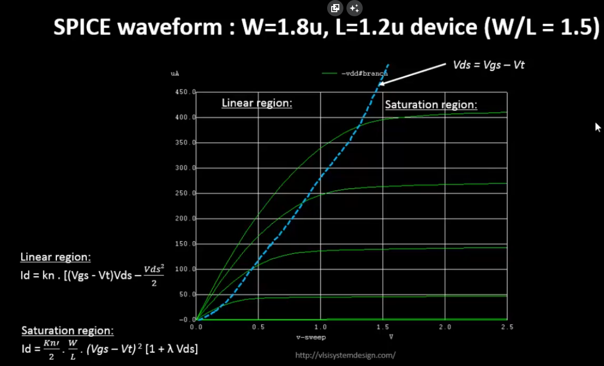 

what happens when u keep W/L constant but switch to a lower node (lower L and W values). larger nodes (left) have quadratic dependance, smalled nodes have Linear dependance due to velocity saturation effects.

 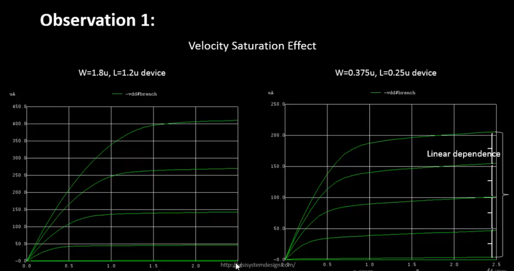 

Id vs Vgs

 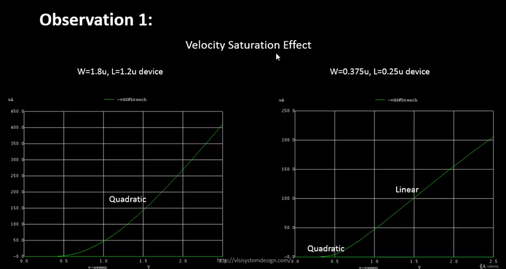 

 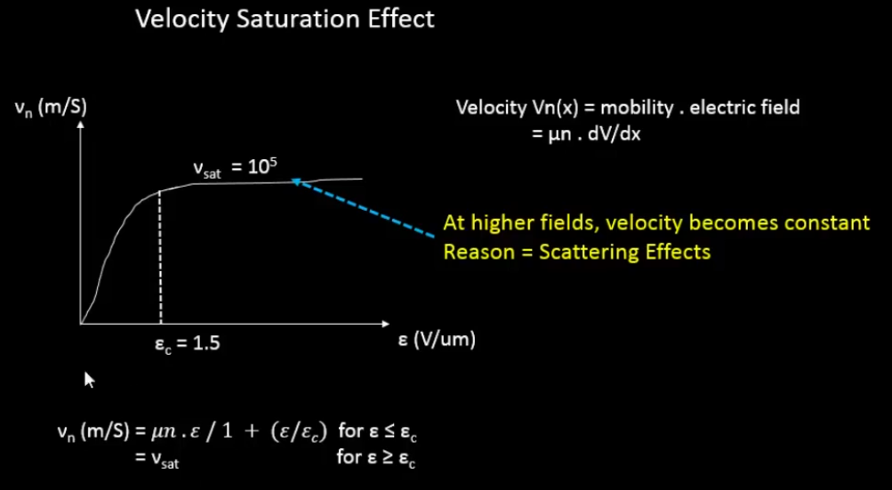 

putting E=Ec for continuity, we get

 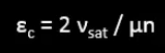 

 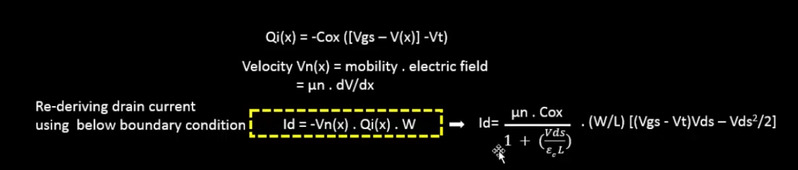 

 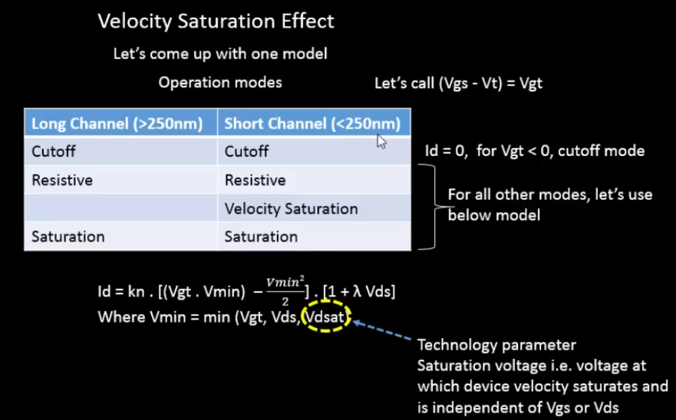 

when vgt is minimum -> vds is more -> saturation region

 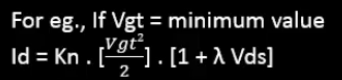 

when vds is minimum -> linear region

 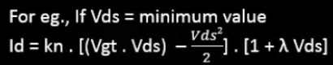 

when vdsat is minimum -> velocity saturation region

 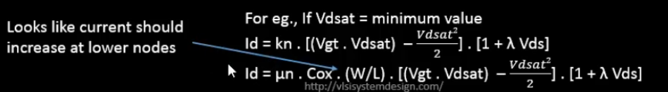 

 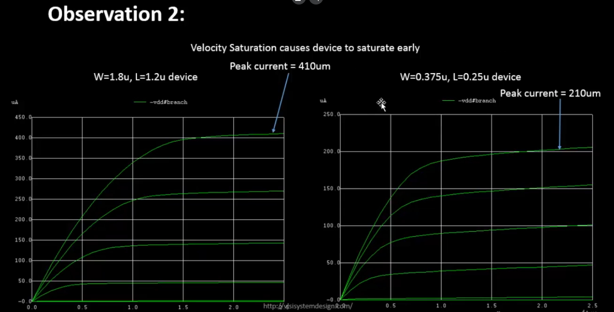 

# lab

## id vs Vds

 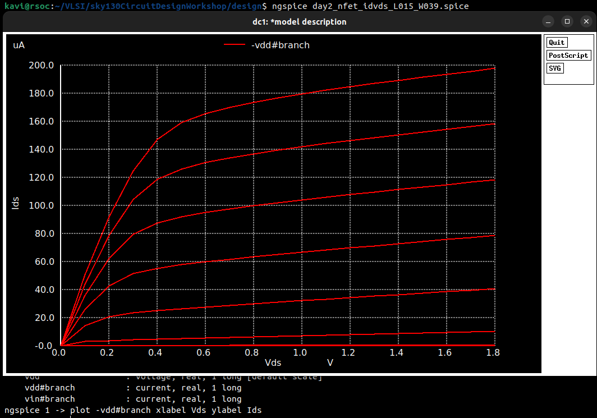 

## id vs Vgs

calculate threshold voltage form id vs vgs curve. draw tangent from linear region of Id

 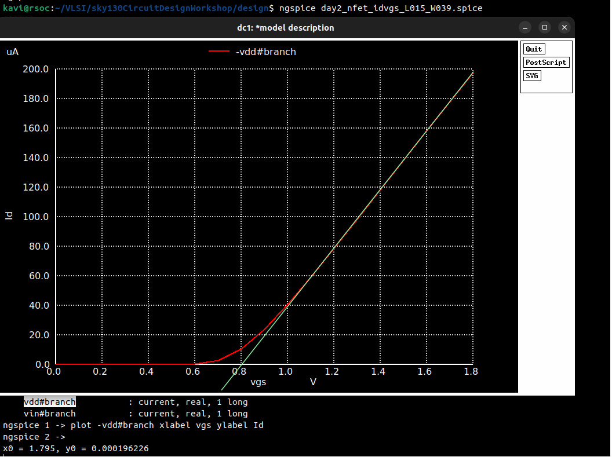 

# CMOS voltage transfer characteristics (VTC)

 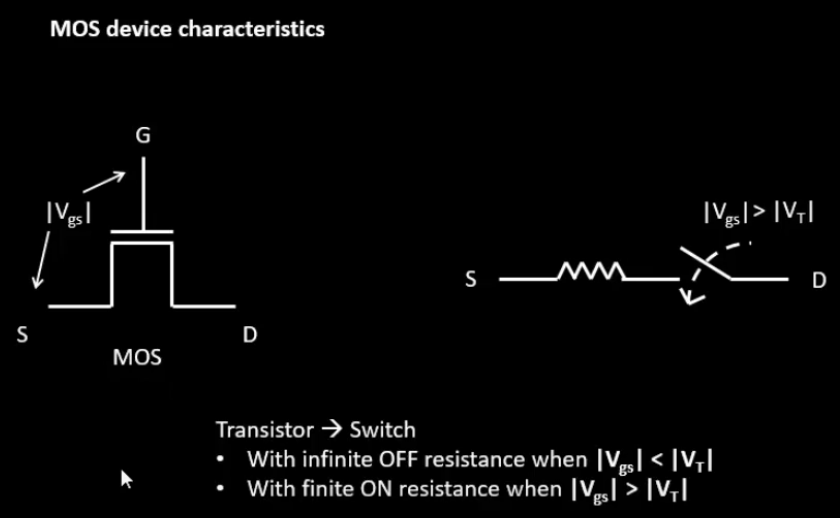 

 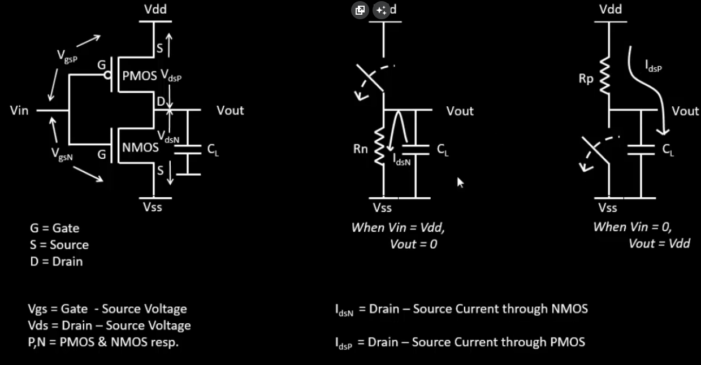 

 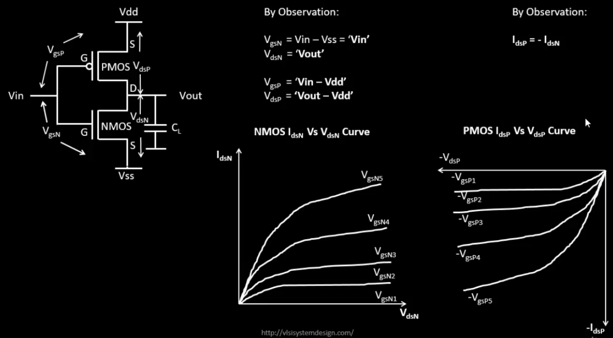 

 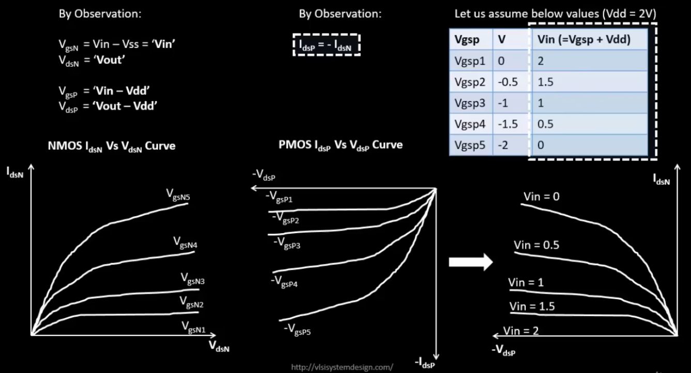 

 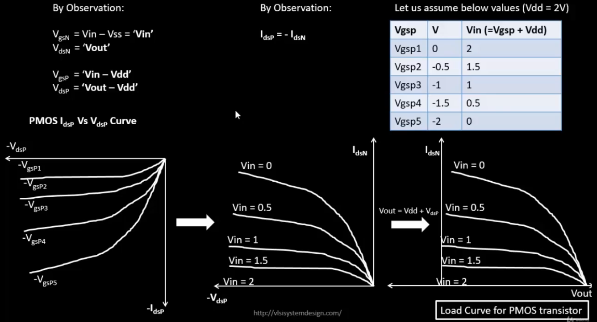 

 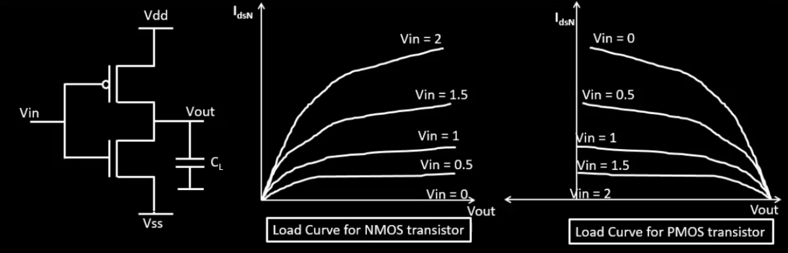 

 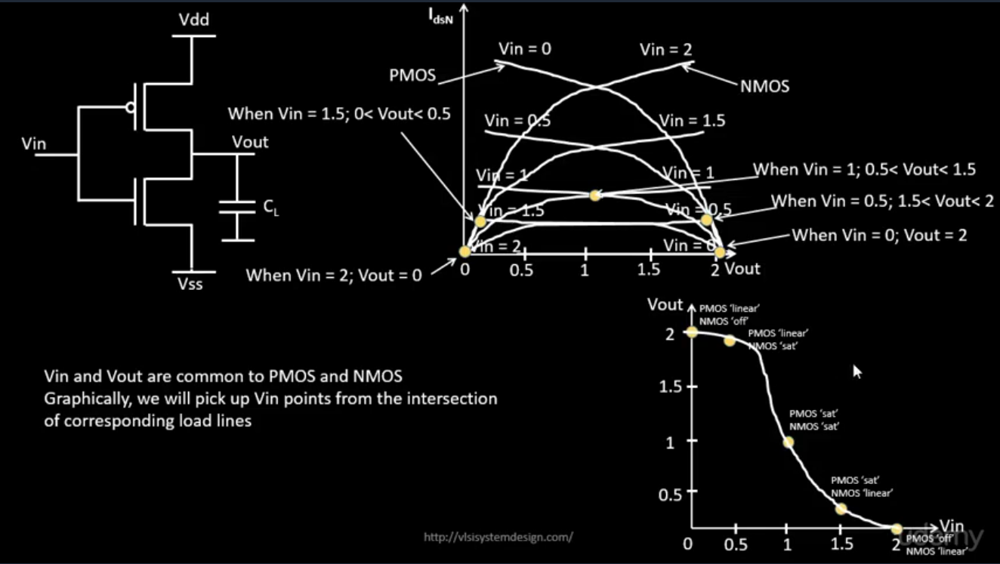 
