# Day 3 - CMOS Switching threshold and dynamic simulations

# Voltage transfer characteristics – SPICE simulations

 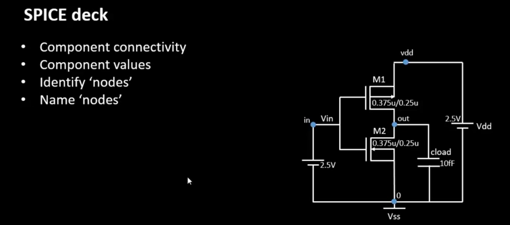 

 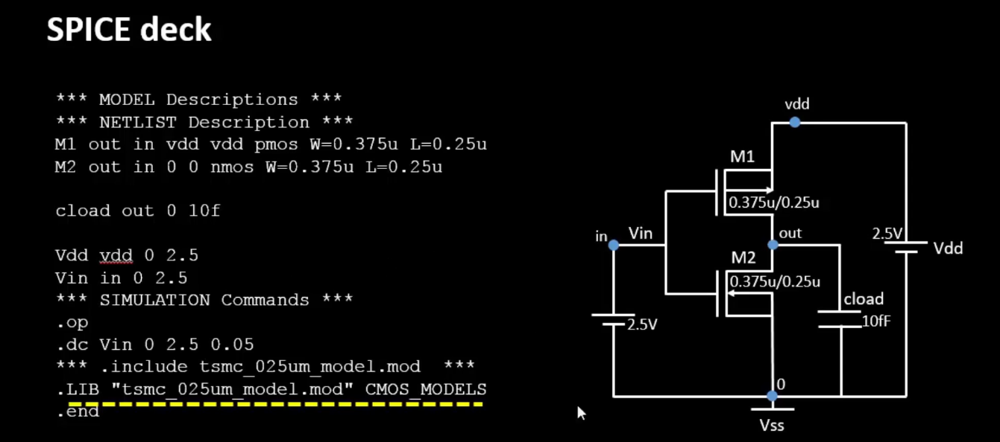 

## Lab

vin vs vout vtc point - switching threshold point

 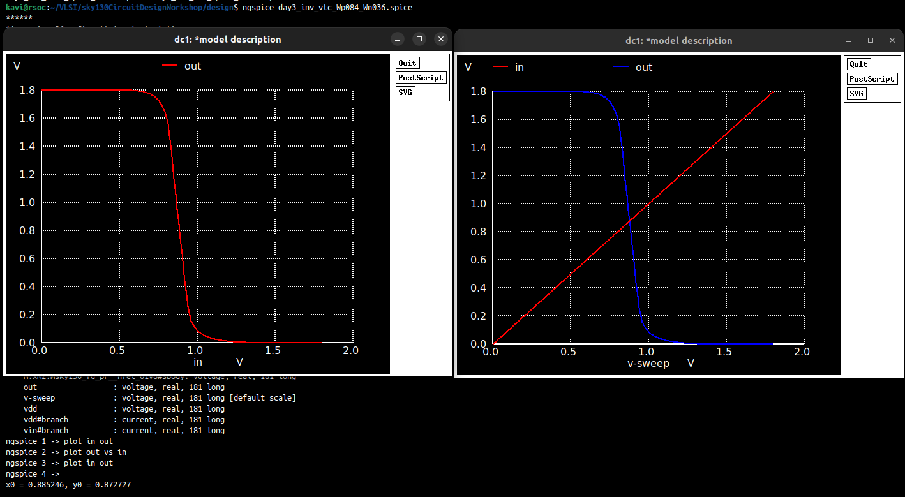 

 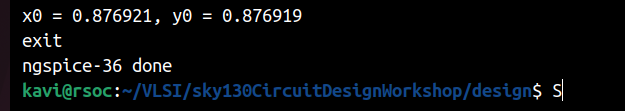 

Transient analysis - rise time and fall time

 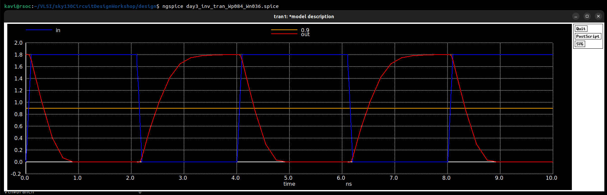 

 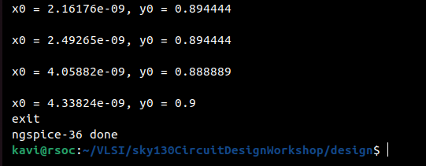 

rise time - 0.331 ns

fall time  - 0.280 ns

# Static behavior evaluation – CMOS inverter robustness – Switching Threshold

effect of Wp/Wn

 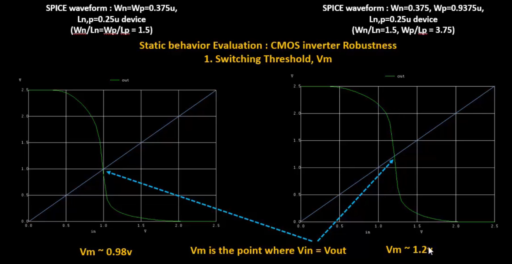 

 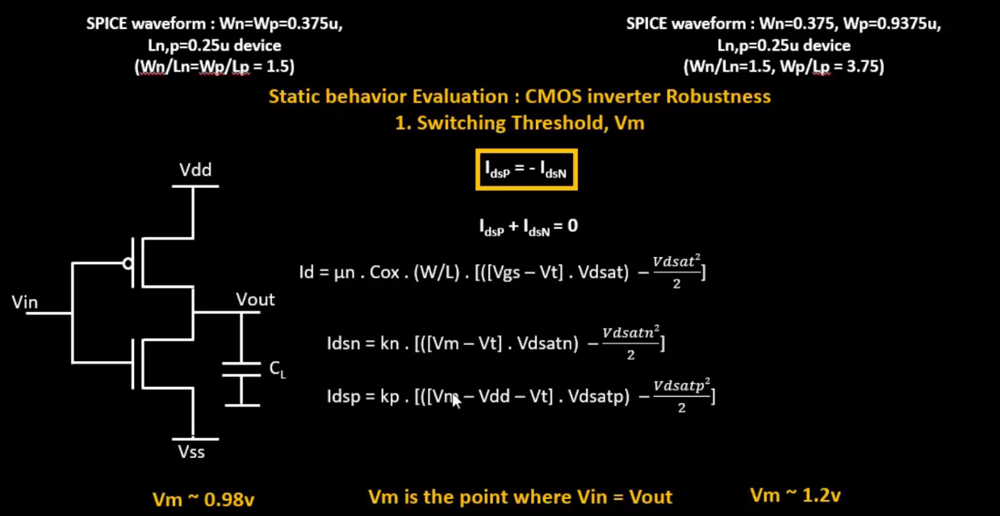 

 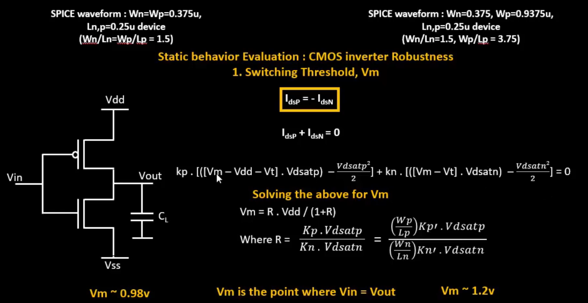 

 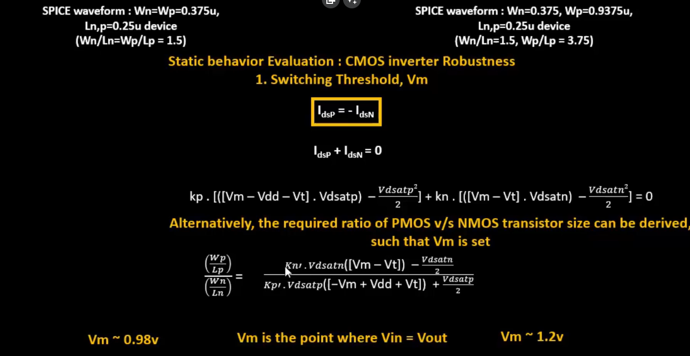 

 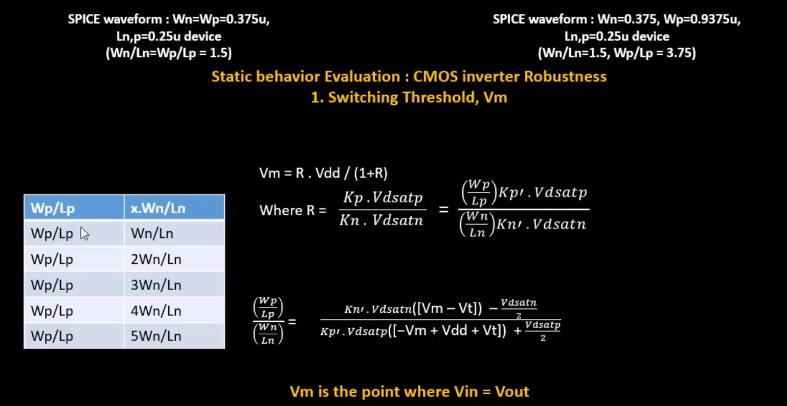 

 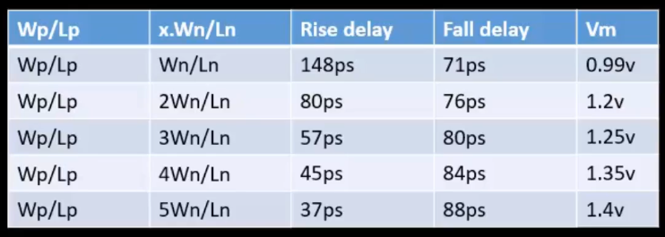 

Switching threshold robustness conclusions

- even when the ratio of W varies due to fabrication , the change in Vm is acceptably low

- at some ratio of W , rise delay = fall delay. imp for clk inverter and buff. having equal pmos and nmos resistance leads to this.
