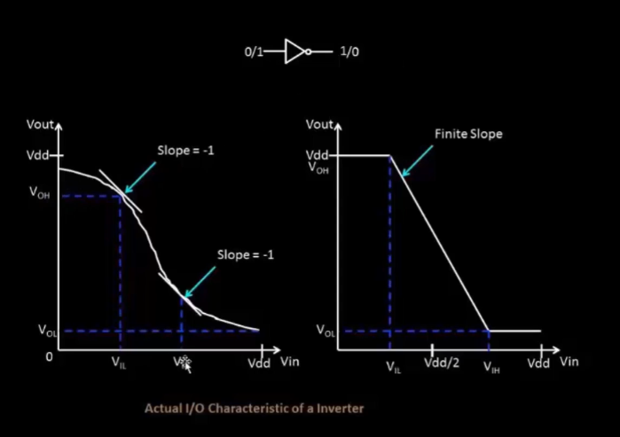
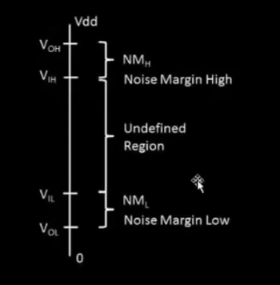
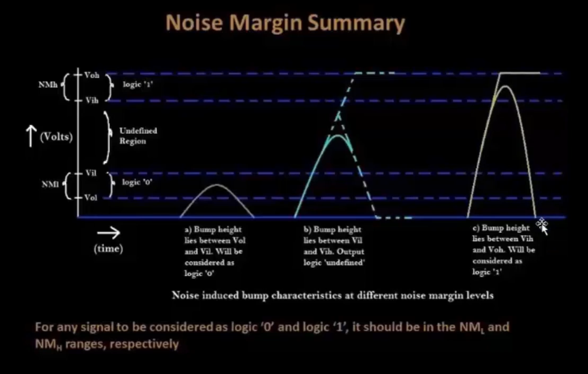
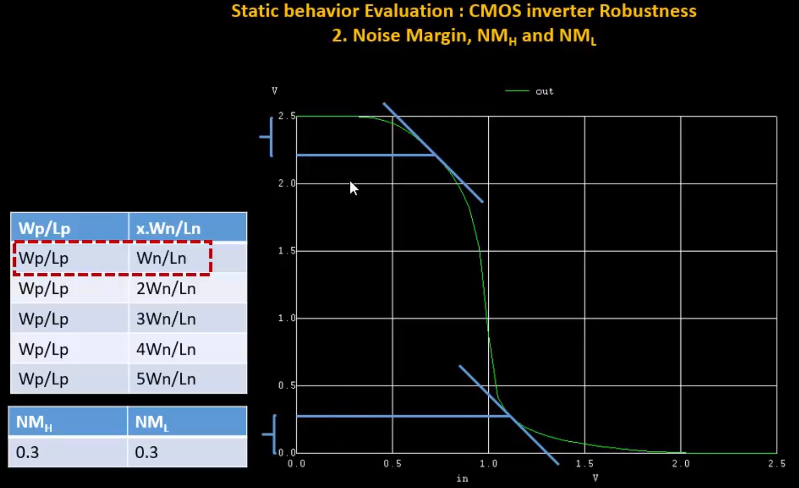
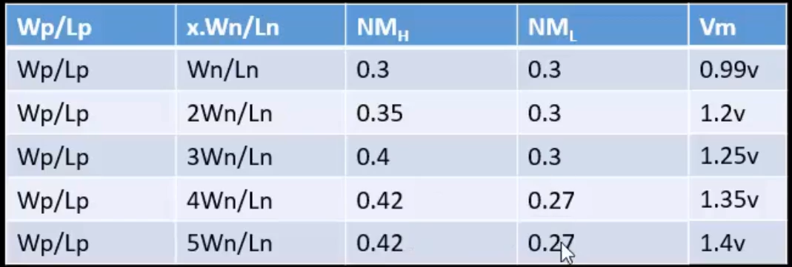
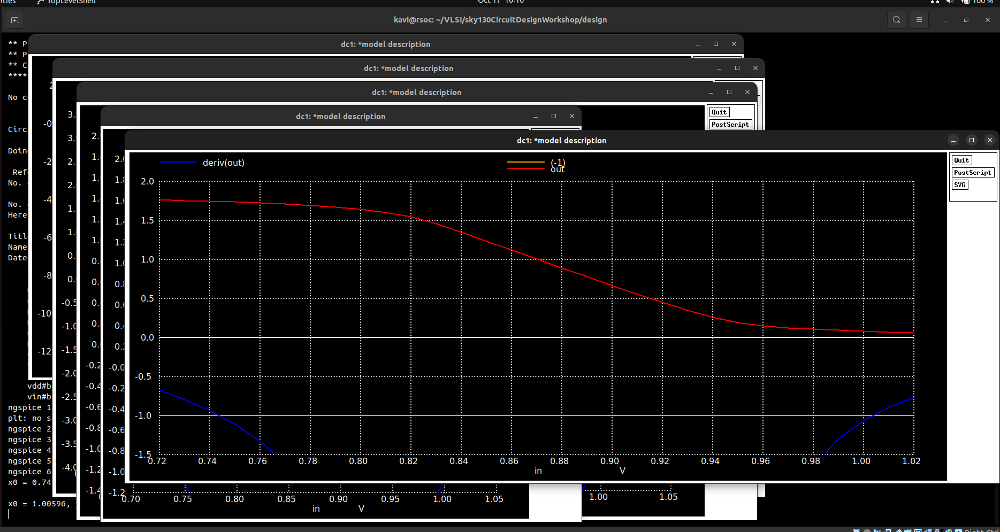
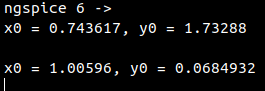

# Day 4 - CMOS Noise Margin robustness evaluation

## Static behavior evaluation – CMOS inverter robustness – Noise margin

CMOs inverter robustness

1. switching threshold - Vm

2. noise margin - NMh, NMl

3. power supply scaling

4. device variation

  

  

  

  

  

  

  

  

# Lab

Noise margin in CMOS inverter

finding points in Vout vs Vin where slope is -1:

  

points where slope is -1:

  

NM(high) = 0.989263

NM(low) = 0.9374668
