# Day 5 - CMOS power supply and device variation robustness evaluation

CMOS invertor robustness - power supply scaling

Scripting in .spice

 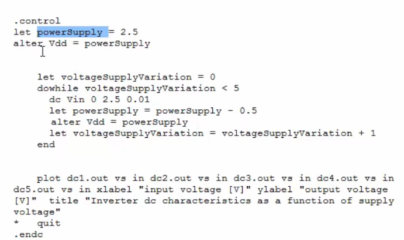 

gain for plot with vdd=2.5V = 7.38

 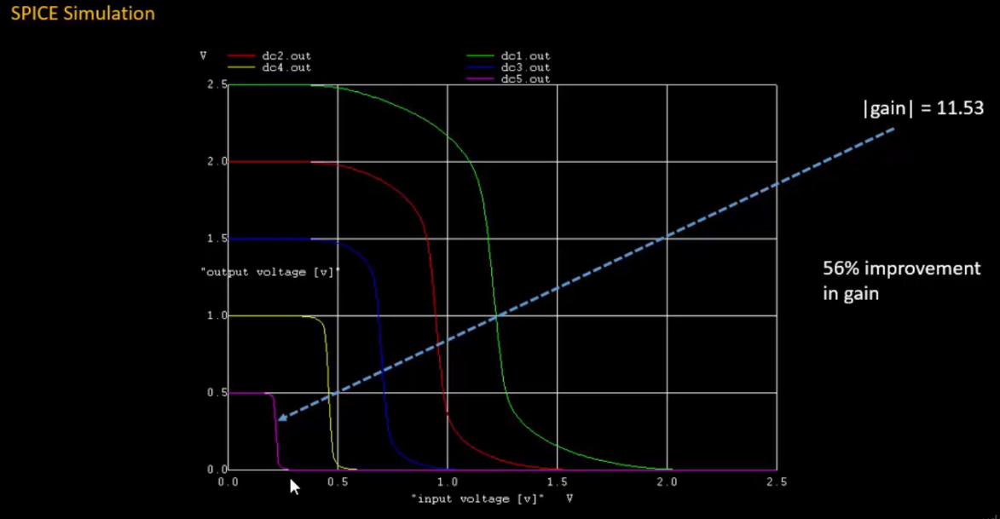 

energy = 0.5cv^2

where v = vdd

 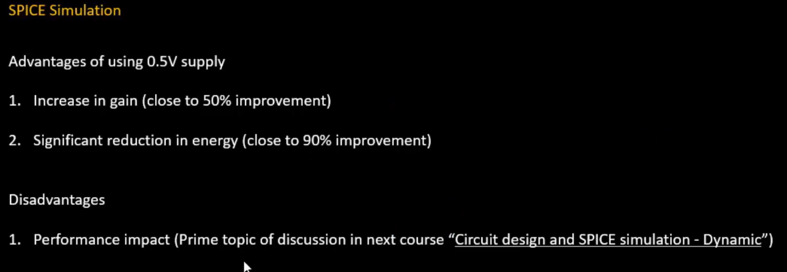 

performance impact - transition time (rise and fall time) increases when vdd is reduced

 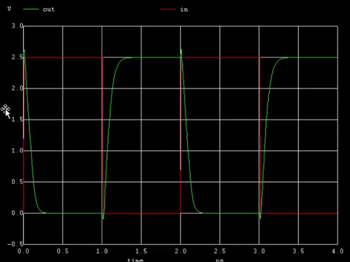 

 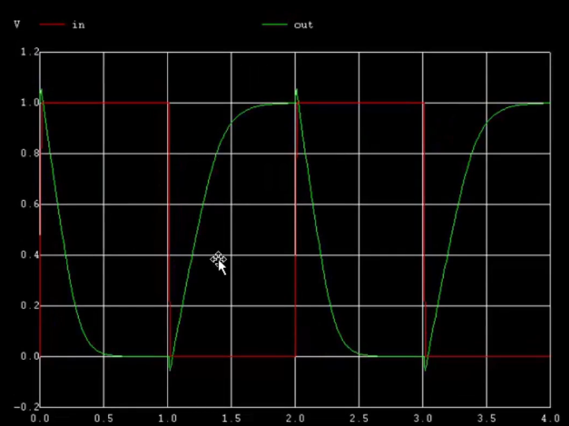 

# Lab - Supply Variation

 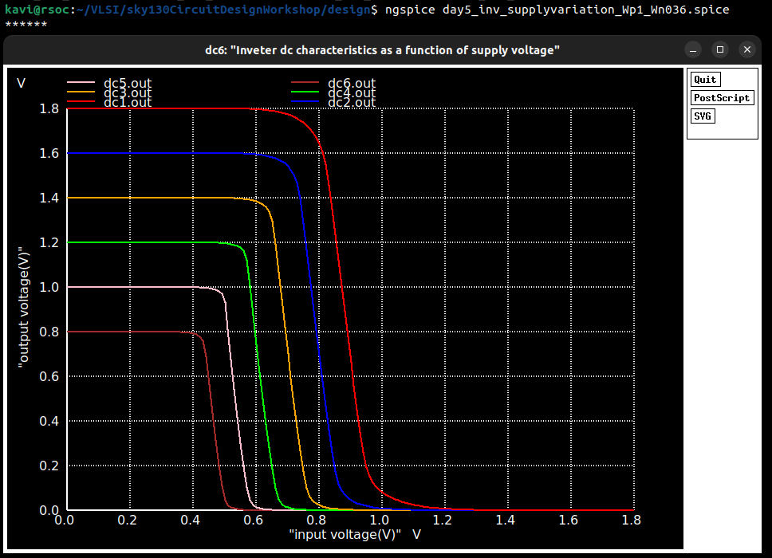 

out vs in on left | gain on right:

 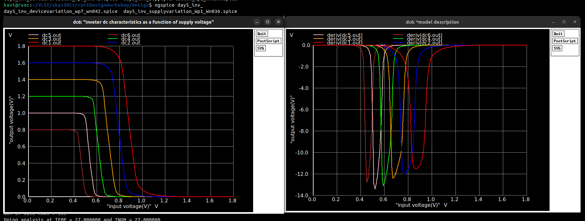 

# Device Variation - Sources of variation

1. Etching process

 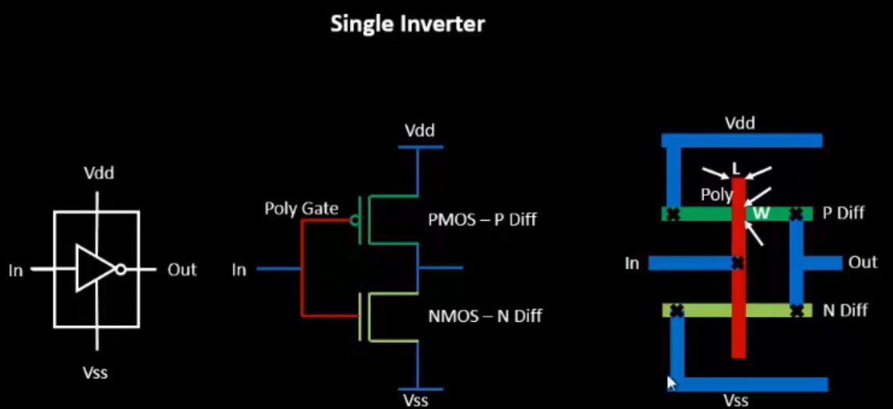 

 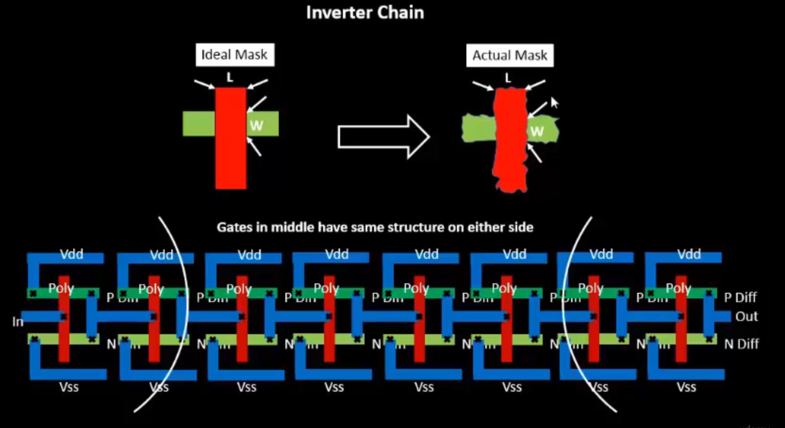 

 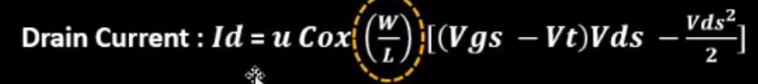 

2. oxide thickness

 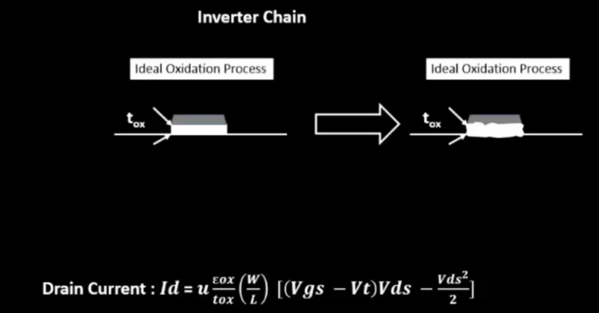 

## SPICE simulation for device variations

 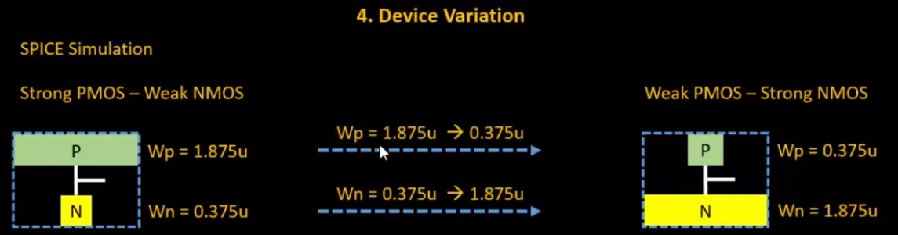 

dc1 - strong pmos, weak nmos| dc5- weak pmos, strong nmos

 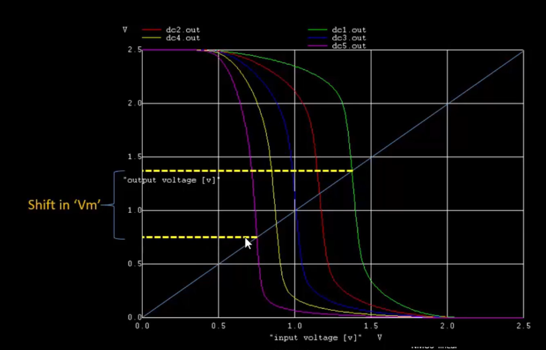 

 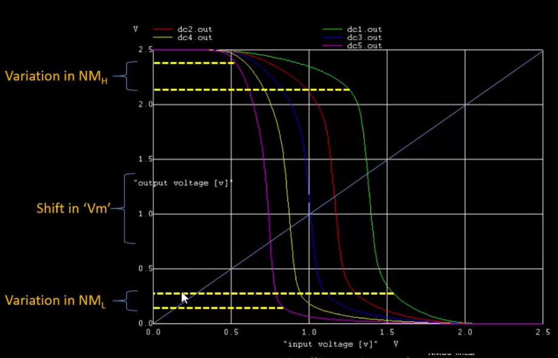 

# Lab - Device Variation

 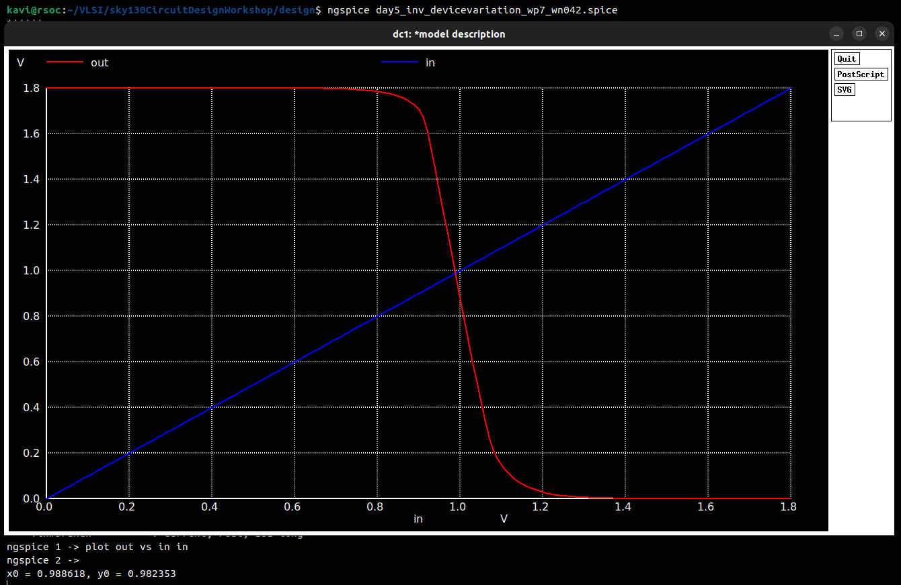 

switching threshold - 0.98. the variation in switching threshold is minimal. CMOS invertor is robust.
